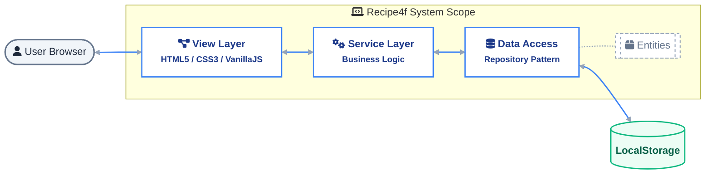

# Recipe4f

A frontend-focused web application designed to showcase cooking recipes and blogs. This project demonstrates the implementation of a client-side Multi-Page Application (MPA) using vanilla web technologies and simulating backend functionality with LocalStorage.

> **Note**: This is a coursework assignment for **Industrial University of Ho Chi Minh City (IUH)**.

## Built With

## Architecture & Structure

The project follows a **Simple Layered Architecture** with clear separation of concerns:

**Note**: This architecture is simplified without complex DTOs to maintain lightweight and straightforward design.

## Key Features

- **Recipe Showcase**: Interactive browsing of detailed cooking recipes
- **Blog Module**: A dedicated section for cooking articles and news
- **Virtual Database**: Full CRUD operations using browser `LocalStorage`
- **Dynamic Rendering**: UI components are generated via JavaScript
- **Responsive Design**: Optimized for Desktop, Tablet, and Mobile devices

## Getting Started

Open `index.html` in any modern web browser from your project workspace.

- _Recommended_: Use "Live Server" extension in VS Code
