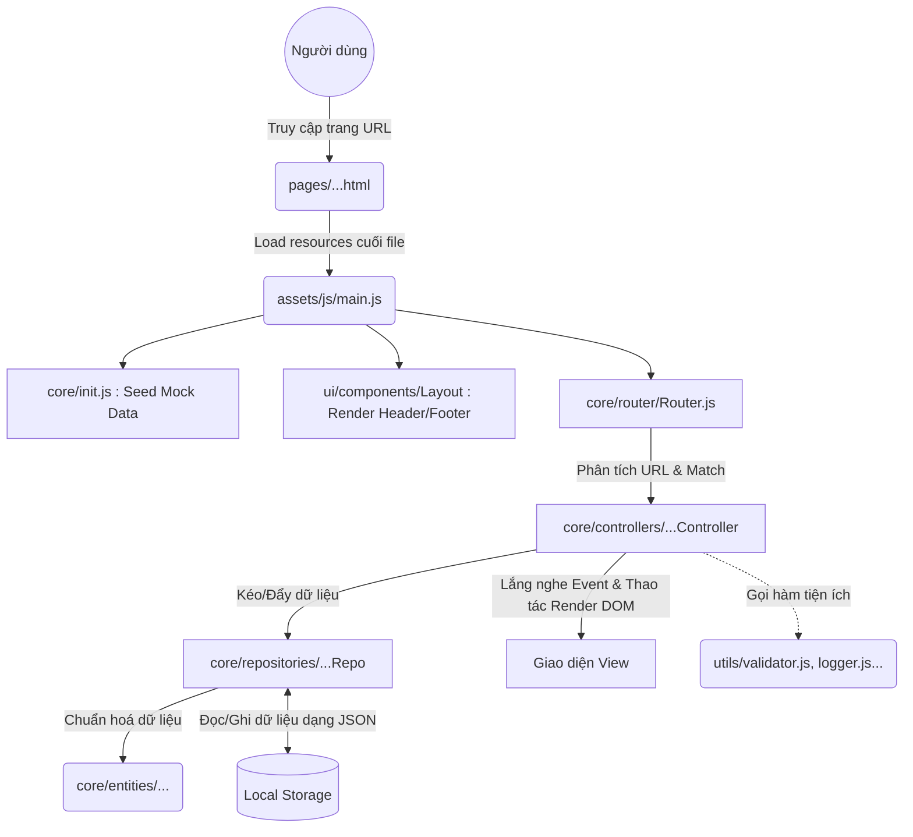

# Tổng quan kiến trúc hệ thống

## 1. Giới thiệu
Dự án "IUH-COOKING-RECIPES" được xây dựng dựa trên Vanilla JavaScript kết hợp với HTML/CSS thuần. Mặc dù không sử dụng các framework hay thư viện UI phức tạp (như React, Vue), dự án vẫn áp dụng tư tưởng của mô hình MVC (Model-View-Controller) và thiết kế phân lớp (Layered Architecture) rất chặt chẽ để đảm bảo khả năng mở rộng, khả năng mở rộng (scalability) và dễ dàng bảo trì trong môi trường làm việc nhóm.

## 2. Tổ chức thư mục

### 2.1 Thư mục `pages/` (View Layer)
Đây là nơi chứa các file HTML tĩnh của dự án (ví dụ: `index.html`, `login.html`, `recipes.html`).
- **Vai trò:** Đóng vai trò là entry point giao diện (phần mặt tiền). Thư mục này chỉ chứa bộ khung HTML thuần và nhúng các file CSS, JS cần thiết.
- **Cách hoạt động:** Thay vì gộp chung logic JS vào file HTML, các thẻ HTML sẽ liên kết tới file gốc duy nhất `assets/js/main.js` nhằm mục đích nhúng (bootstrap) toàn bộ ứng dụng ở bước cuối cùng trước khi load xong giao diện.

### 2.2 Thư mục `assets/js` (Logic Layer)

Đây là "nơi chứa não bộ" của dự án với kiến trúc được module hóa rành mạch, chia làm nhiều tầng nhỏ chịu các trách nhiệm khác biệt:

- **`core/`**: Chứa các thành phần cốt lõi quản lý điều phối luồng thực thi và dữ liệu.
  - **`controllers/`**: Đóng vai trò là (C - Controller). Xử lý logic nghiệp vụ cụ thể cho từng trang. Nhận kết quả từ thao tác của người dùng trên giao diện View, tương tác với Repositories để lấy hoặc sửa đổi dữ liệu, và quyết định cập nhật lại View tương ứng.
  - **`repositories/`**: Đóng vai trò là (M - Model). Lớp truy xuất cơ sở dữ liệu (Database Access Layer). Thao tác trực tiếp với luồng dữ liệu thô lưu tại Local Storage thông qua Singleton Pattern (như `UserRepository`, `RecipeRepository`). Tách biệt hoàn toàn việc lưu trữ với Controller.
  - **`entities/`**: Chứa các object schema định nghĩa cấu trúc dữ liệu, các lớp đại diện cho từng thực thể (như `User`, `Recipe`, `Category`). Đảm bảo dữ liệu trích xuất từ database luôn tuân theo một khuôn chuẩn tránh sai lệch kiểu dữ liệu.
  - **`router/`**: Bộ điều hướng các trang (Routing). Nhờ cơ chế này, app đóng vai trò nhận diện xem người dùng đang ở đường dẫn (`window.location.pathname`) nào và gọi lên Controller đích xác được ánh xạ với path đó (Ánh xạ thông qua khai báo trong `const.js`).
  - **`services/`**: Cung cấp các business logic chuyên biệt dùng chung, hỗ trợ giảm tải logic đồ sộ cho Controller nếu nghiệp vụ mở rộng.
  - **`init.js`**: Nơi khởi tạo dữ liệu mồi (Mock seed data). Nó chèn dữ liệu ban đầu vào Local Storage nếu dữ liệu chưa tồn tại khi ứng dụng khởi chạy lần đầu đảm bảo UX liền mạch tức thời.

- **`ui/components/`**: Chứa các lớp Javascript chi phối trực tiếp lên DOM phục vụ các thành phần UI dùng chung xuyên suốt dự án. 
  - **Vai trò:** Góp phần giải quyết bài toán tái sử dụng mã (Reusability). Thay vì phải code lặp lại Header, Footer vào tệp HTML ở `pages/`, ta đóng gói chúng thành thẻ JS để tự động render (inject) vào DOM thông qua component chủ đạo là `Layout.js`.

- **`utils/`**: Các hàm chuẩn hóa tiện ích không gắn logic nghiệp vụ ứng dụng cụ thể nào (như `logger.js` - ghi log lỗi console độc lập, `validator.js` - xử lý quy tắc thông báo lỗi trên Form, `main.js` - main root entrypoint).

- **`libs/`**: Nơi lưu trữ code của bên thứ 3 phục vụ app chạy offline (Bootstrap 5, Lucide-icon vẽ biểu tượng, Marked.js render markdown).

## 3. Sơ đồ xử lý hệ thống (Architecture Flow)

## 4. Tổng kết đánh giá
Kiến trúc của "IUH-COOKING-RECIPES" rất chuyên nghiệp cho một đồ án Vanilla JS. Cấu trúc tuân thủ **Separation of Concerns (SoC)** (Nguyên lý Phân tách Mối quan tâm):
- Giao diện thuần (HTML) không dính logic tính toán.
- Controller giải quyết logic nghiệp vụ mà không dính cấu trúc lệnh thay đổi Database (Repo).
- Dữ liệu thô (LocalStorage) được cô lập bởi mô hình Repo, giúp đảm bảo tính hợp lệ, định dạng và tính toàn vẹn (Entities) trước khi tới tay các thành phần khác.
- Các module giao diện Header/Footer/Card được component hoá rõ ràng. Hệ thống Route chạy như một lõi Single Page App nhỏ dù vẫn hoạt động trên mô hình Multi-page truyền thống.
