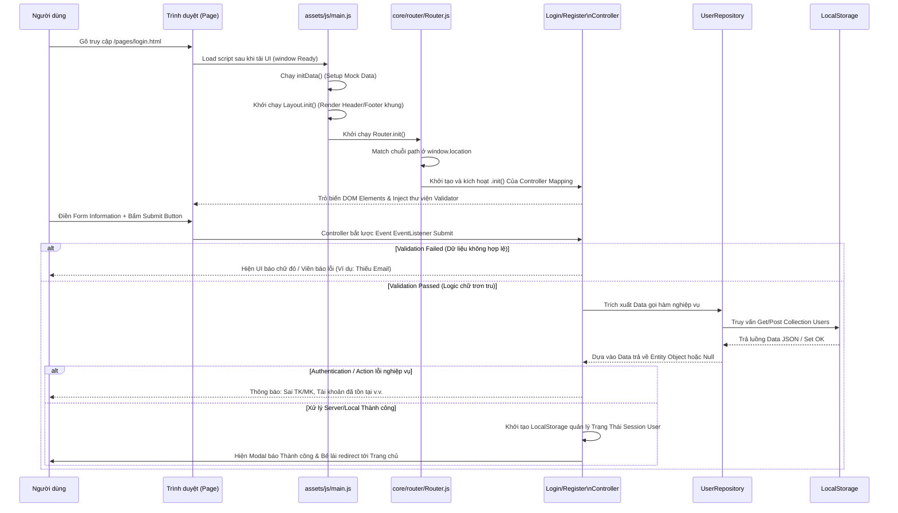

# Chi tiết quá trình Render trang Login / Register

## 1. Giới thiệu quá trình khởi động ứng dụng (Bootstrap Flow)
Ở dự án IUH-COOKING-RECIPES, bất kỳ khi nào người dùng truy cập một trang trong thư mục `pages/` (ví dụ `login.html` hay `register.html`), trình duyệt sẽ thực thi qua file script đầu não (entry point) là `assets/js/main.js` nằm tại cuối thẻ `<body>`. 

Luồng thực thi hệ thống bắt đầu ở `main.js` đi theo vòng đời (lifecycle) thứ tự sau:
1. `initData()` ở file `core/init.js` được gọi **ĐẦU TIÊN**. Hệ thống kiểm tra LocalStorage xem CSDL chuẩn đã seed hay chưa. Nếu chưa nó sẽ tiến hành chèn toàn bộ dữ liệu mẫu (Users, Recipes, ...) của dự án trước khi render các element nhằm để tránh bug blank (trắng màn) khi tương tác.
2. `new Layout().init()` ở `ui/components/layout.js`. Quá trình này sẽ vẽ ra phần vỏ giao diện chung (`Header`, `Footer`) và nhúng trực tiếp vào các container DOM rỗng. Điều này khẳng định app tái sử dụng hoàn toàn UI và HTML tĩnh không phải chèn thủ công mã.
3. `new Router().init()` ở `core/router/router.js`. Đây là bộ não trung tâm đảm nhận vai trò định tuyến, quyết định xem màn hình hiện tại thuộc loại nào để phân bổ đúng thành phần logic nghiệp vụ (Controller).
4. `window.lucide.createIcons()` gọi hàm API parse sinh ra icon SVG trên giao diện.

## 2. Luồng hoạt động của Module Router
Sau khi `Router` lên nắm quyền điều khiển ứng dụng, nó thiết lập hoạt động như sau:
1. Lấy đường dẫn hiện hành thực tại của trình duyệt bằng `window.location.pathname`. (Ví dụ trả về: `/pages/login.html`).
2. Regex chéo (mẫu cấu trúc RegExp) đối chiếu với mảng danh sách các đường dẫn định nghĩa sẵn trong `core/router/const.js` (`ROUTES_ENTRIES`).
3. Nếu tìm thấy đường dẫn hợp lệ ứng với `ROUTES.LOGIN`, `Router` tiến hành trích xuất mảng Controllers và sẽ lấy ra `LoginController`.
4. `Router` lập tức tạo thể hiện (instance object) của Controller này và invoke hàm `controller.init()` - Phương thức bắt đầu vòng đời (lifecycle) đầu tiên cho các controller xử lý tác vụ trên màn hình đó. Quá trình hoạt động trang đăng ký cho `RegisterController` là tự diễn biến tương tự.

## 3. Hoạt động bên trong của Login/Register Controller
Một khi hàm vòng đời `.init()` trong Controller (`LoginController` hoặc `RegisterController`) bắt đầu kích hoạt:

### Bước 3.1: Gắn kết tài nguyên trên View (DOM Binding)
Nhiệm vụ đầu tiên của Controller quy tụ các Node có trên DOM. Nó tìm kiếm và lưu lại đối tượng của Form, đối tượng của các Input (email, password) và của các node báo lỗi. 

### Bước 3.2: Khai báo lớp bảo vệ Xác thực (Validation)
`LoginController` và `RegisterController` sẽ khởi tạo instance của Module Validator tại `utils/validator.js` để gắn các quy tắc xác thực (rules constraints) lên Form (Cụ thể: email đúng chuẩn pattern, bắt buộc nhập (required), hay password có độ dài tối thiểu, verify password có khớp nhau không).

### Bước 3.3: Lắng nghe chuyển động người dùng (Event Listening)
Controller gắn Listener theo dõi sự kiện `submit` vào đối tượng Form của trang.
- Người dùng tương tác xong và ấn nút Submit: Hàm thực thi mặc định nhảy trang bị chặn lại bằng `e.preventDefault()`.
- Việc test tính hợp lệ thông qua Validation Engine được trigger.
- Nếu Input chưa đạt trên Validator, app render ra CSS DOM báo màu đỏ viền. Nếu pass input an toàn, Controller đi vào Bước 4.

### Bước 3.4: Tương tác Tầng Repository / LocalStorage
Controller gọi qua Singleton Interface - Ví dụ đại diện: `UserRepository.getInstance()` với tham số gửi lên:
- Phía Đăng Nhập: `.findByEmailAndPassword(email, pass)` để quét mảng người dùng check khớp Account nằm trong thư mục Data của `LocalStorage`.
- Phía Đăng Ký: `.findByEmail(email)` check độc quyền bị xài hay chưa; không trục trặc thì `.save(newUser)` để chèn dòng vào database cho Local Storage.

### Bước 3.5: Trả về trạng thái phản hồi tới Giao Diện (State Reflection)
Dựa vào Boolean response qua Entity hay Null từ Repo, Controller tự quyết định hiển thị modal / text thông báo lỗi: Tài khoản không có, bị trùng mật khẩu... Nếu đăng nhập/đăng ký thành công, trạng thái session chứng chỉ (thêm User hiện hữu) sẽ được chốt lại và Controller đẩy `window.location.href = ROUTES.HOME.path/` chuyển hướng người dùng tự động nhảy trở lùi về màn hình Home.

## 4. Sơ đồ Luồng Sequence Diagram (Hoạt động Đăng nhập / Đăng ký)

