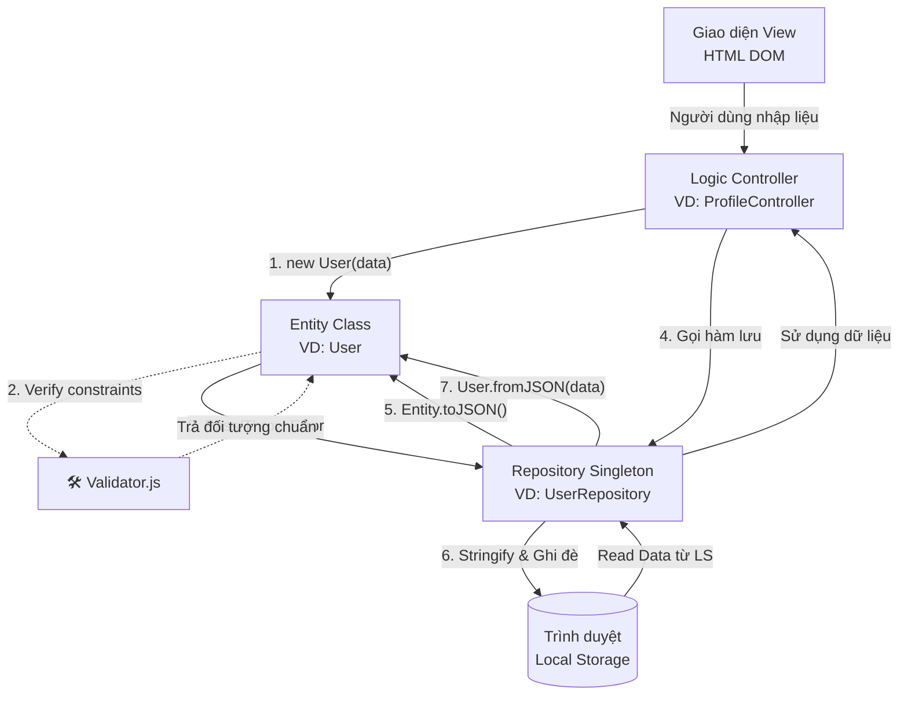

# Tương tác Dữ liệu với Local Storage và Repository

## 1. Cơ chế lưu trữ tổng quan
Mọi ứng dụng Web thuần (không có backend server thực sự) đều cần một cơ chế để bảo toàn trạng thái dữ liệu khi người dùng làm mới trang (F5). Thay vì sử dụng cơ sở dữ liệu thật như MySQL hay MongoDB, "IUH-COOKING-RECIPES" tận dụng `Local Storage` của trình duyệt làm kho chứa (Database).

Tuy nhiên, nếu ta trực tiếp gọi các phương thức `localStorage.getItem()` hay `localStorage.setItem()` rải rác khắp mã nguồn Controller, dự án sẽ:
- Dễ sinh ra code rác (Spaghetti code).
- Khó tái sử dụng và khó module hóa.
- Dễ làm sai cấu trúc, hỏng dữ liệu khi thay đổi schema.

Do đó, dự án đã bọc lại toàn bộ quy trình này thông qua **Repository Pattern** và **Entities**.

---

## 2. Lớp Thực thể (Entity)
Thư mục `assets/js/core/entities/` chứa các class đóng vai trò làm định dạng chuẩn rập khuôn (schema) cho dữ liệu. Ví dụ `user.entity.js` hay `recipe.entity.js`.

### 2.1 Đặc điểm của Entity trong dự án
- **Encapsulation (Tính đóng gói):** Sử dụng thuộc tính private (`#email`, `#password`) để bảo vệ dữ liệu không bị ghi đè trực tiếp cẩu thả.
- **Validation (Tính toàn vẹn):** Bất kỳ lệnh gán (Setter) nào tới Entity đều lọt qua màng lọc `Validator.js`. Nếu chuỗi input sai định dạng, Exception sẽ bị ném (throw error) ngay lập tức, ngăn ngừa lưu dữ liệu dỏm xuống database.
- **Biến đổi JSON (Serialization/Deserialization):** Gồm 2 hàm cốt lõi chịu trách nhiệm giao tiếp ranh giới:
  - `toJSON()`: Phân giải Entity -> JavaScript Object thuần -> Sẵn sàng lưu `LocalStorage`.
  - `fromJSON(data)`: Tạo mới Entity Object -> Từ một Object lấy lên từ `LocalStorage`.

---

## 3. Lớp Kho chứa (Repository Pattern)

Thư mục `assets/js/core/repositories/` chịu trách nhiệm độc quyền tương tác với kho lưu trữ. Controller KHÔNG ĐƯỢC PHÉP chạm vào LocalStorage trực tiếp.

### 3.1 BaseRepository
Lớp `repository.js` chứa các lệnh CRUD kinh điển (Create, Read, Update, Delete) như:
- `findAllRaw()`: Đọc JSON nguyên thủy ở Storage lên dưới dạng Array Object.
- `save(entity)`: Trích xuất ID, tìm kiếm trong mảng JSON. Nếu phát hiện ID đã có -> Chèn đè (Update). Ngược lại -> Thêm mới vào chuỗi.
- `delete(id)`: Lọc ID ra khỏi mảng và `.setItem()` ghi đè lại vào bộ nhớ.

### 3.2 Kế thừa và Singleton Pattern 
Để tránh việc khởi tạo hàng chục class `UserRepository` làm dư thừa bộ nhớ trình duyệt, dự án áp dụng quy tắc **Singleton**: 
Lớp con được khởi tạo một Instance duy nhất trong toàn vòng đời và mọi module khác lấy tham chiếu đó ra xài.

```javascript
import BaseRepository from './repository.js';

class UserRepository extends BaseRepository {
    static #instance = null;
    
    // Đảm bảo chỉ có 1 UserRepository duy nhất tồn tại
    static getInstance() {
        if (!this.#instance) new UserRepository();
        return this.#instance; // Cấp phát tham chiếu duy nhất
    }

    // Logic nghiệp vụ bổ trợ chuyên biệt
    findByEmail(email) {
        return this.findAll().find(u => u.email === email);
    }
}
```

---

## 4. Sơ đồ Tương tác Dữ Liệu (Mermaid Diagram)

Dưới đây là sơ đồ luồng dữ liệu (Data Flow) khi tạo mới một Công thức nấu ăn hoặc chỉnh sửa thông tin người dùng:



---

## 5. Ưu điểm thực chiến của Kiến Trúc Này
Nếu cần thêm tính năng mới (Ví dụ như *"Lưu danh sách Recipe yêu thích"*), bạn tuân theo nguyên tắc Open-Closed:
1. Thêm mảng `favoriteRecipes` vào nội tại class `User` Entity. Sửa `toJSON()` và `fromJSON()`.
2. Controller gọi `User.favoriteRecipes.push(id)`.
3. Nhờ Repo lưu lại: `UserRepository.getInstance().save(user)`.

**Kết luận:** Controller của bạn không cần quan tâm chuỗi lưu như thế nào. Code cô lập triệt để, cực kì an toàn.
