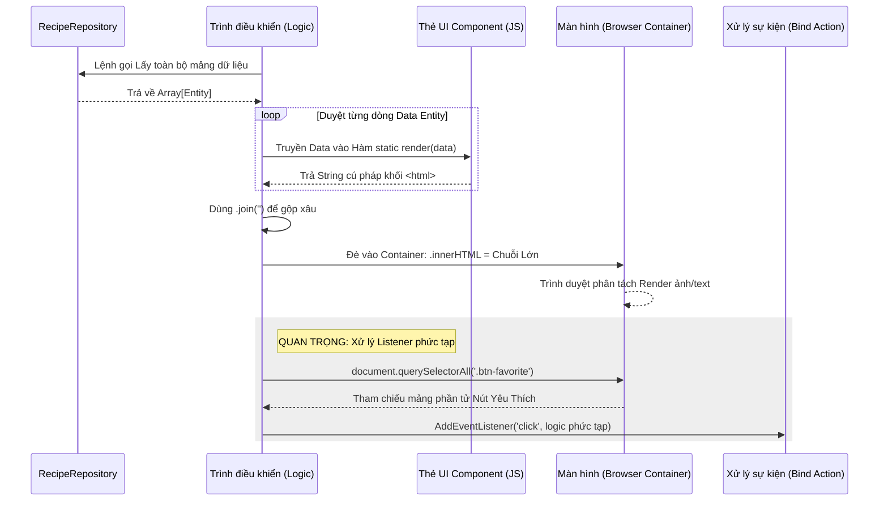

# Hướng dẫn Xây dựng và Tái sử dụng UI Component

## 1. Tư tưởng Component Giao Diện trong Vanilla JS
Vanilla JS không sở hữu cú pháp tiện lợi để render các Module tĩnh như `.jsx` (React) hay `.vue`. Mặc dù vậy, hệ thống "IUH-COOKING-RECIPES" hoàn toàn mô phỏng lại tiến trình tái sử dụng Component bằng thủ thuật **String Template Literal**.

Bằng cách đóng gói những đoạn mã HTML tĩnh lặp đi lặp lại cùng một biến `data` vào Javascript, bạn dễ dàng `inject` (chèn) chúng vào mọi giao diện rỗng chỉ qua 1 dòng lệnh.

---

## 2. Kỹ thuật "Mò" Component và Tái sử dụng Style 

Bởi bì đồ án không lệ thuộc Framework Material nào ngoài **Bootstrap 5**, khả năng cấu trúc CSS và phân biệt class HTML là yếu tố quyết định.

### 2.1 Cấu trúc file chuẩn yếu
Nếu cần style mới, đừng gõ bừa vào file cũ. Hãy tuân thủ kiến trúc thư mục `assets/css/`:
- `root.css`: Lưu trữ biến (Variables) trung tâm (Ví dụ `--primary-color`), định dạng margin móng.
- `typography.css`: Quy định font-family, cỡ biến chữ (headings).
- `style.css`: Quy định CSS gốc và layout nền.
- `component.css`: Lưu CSS cho từng Block UI (Card, Nút, Badge).
- `pages/` & `layout/`: Đóng gói cục bộ tránh conflict.

### 2.2 Quy trình bóc tách Style bằng DevTools
Để Code nhanh một tính năng mà không phá vỡ tính đồng bộ màu sắc của đồ án:
1. Nhấn `F12` > tab `Elements` > Chọn Select Element mũi tên nhỏ.
2. Trỏ vào một Item bạn ưng ý hiển thị kế bên trên giao diện.
3. Chú ý khung "Styles" cột bên phải màn hình:
   - Thấy `py-3`, `ms-2`, `d-flex`... ➞ **Bootstrap Utility**. Hãy copy nguyên đúc mà không cần viết file CSS tay nào.
   - Thấy class như `recipe-card-wrapper` ➞ Nhìn bên phải thấy nguồn xuất phát từ `component.css`. Đây là class chuyên biệt ta tự thiết kế. Hãy dùng chung tên class này để kế thừa kiểu mẫu độ bo góc, cái bóng (box-shadow).

---

## 3. Quy trình thực hành triển khai UI Component

Để thực sự nắm rành thủ thuật, chúng ta mô phỏng quá trình tạo ra một Component **Món Ăn (RecipeCard)**.

### Bước 1: Khởi tạo Class Component tại `ui/components/`
Thành lập file `RecipeCard.js` (Export nó).

```javascript
export class RecipeCard {
  // Biến cấu trúc hàm này nhận vào một Object Recipe Data
  static render(recipeData) {
    return `
      <div class="col-md-4 mb-4">
        <!-- class nội tại recipe-card-custom nằm ở component.css -->
        <div class="card shadow-sm h-100 recipe-card-custom">
           
           <div class="card-body">
              <h5 class="card-title text-primary">${recipeData.name}</h5>
              <p class="card-text text-muted small">${recipeData.description.substring(0, 100)}...</p>
           </div>
           <div class="card-footer bg-transparent border-0 pb-3">
               <!-- Điều hướng ngay trên HTML tĩnh -->
               <button class="btn btn-primary w-100" 
                       onclick="window.location='/pages/recipe-detail.html?id=${recipeData.id}'">
                 Chi Tiết
               </button>
           </div>
        </div>
      </div>
    `;
  }
}
```

### Bước 2: Gọi Component xuất ra View từ Controller
Phía Controller (Ví dụ: `RecipeController.js`), thao tác đơn giản lấy API/Repo và tiêm vào phần tử Container có sẵn trên HTML.

```javascript
import { RecipeCard } from '../ui/components/RecipeCard.js';

// 1. Chỉ định container
const container = document.getElementById('recipe-grid-container');
// 2. Kéo dữ liệu Repo
const recipes = RecipeRepository.getInstance().findAll();

// 3. String nối vòng lặp map
const htmlContent = recipes.map(recipe => RecipeCard.render(recipe)).join('');
// 4. Inject
container.innerHTML = htmlContent;
```

---

## 4. Sơ đồ Luồng Vòng Đời Component (Mermaid Diagram)

Cách một Component sống từ dữ liệu biến thành giao diện HTML mà mắt người dùng thấy:



> **🔥 Lưu ý Đặc Biệt Về Listener (Giai đoạn Cuối Sơ đồ Trên):**
> Các lệnh trong thuộc tính `onclick="()"` trên chuỗi html gốc chỉ trỏ thẳng ra môi trường `Window` (phạm vi global). 
> Nếu nút nội tại Component cần truy xuất logic lớn ở Controller (Hàm xử lý form, thay đổi thuộc tính `favoriteRecipes` của file User DB), bạn bắt buộc phải Query Node DOM và gọi lệnh `addEventListener()` sau khi `innerHTML` thực hiện xong.
